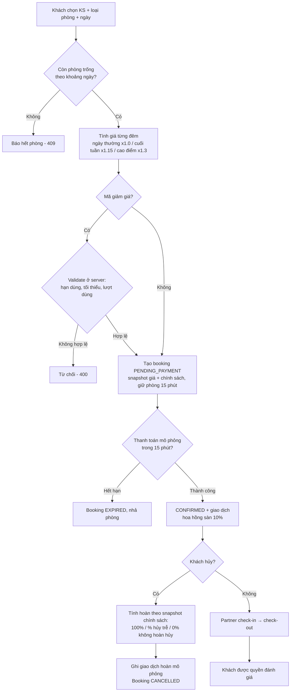
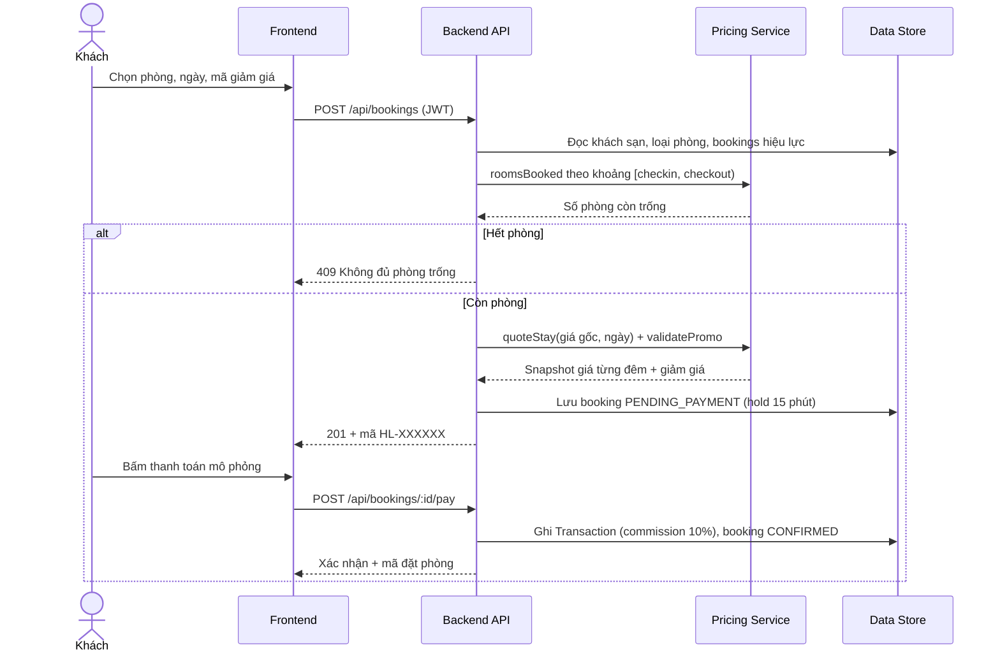
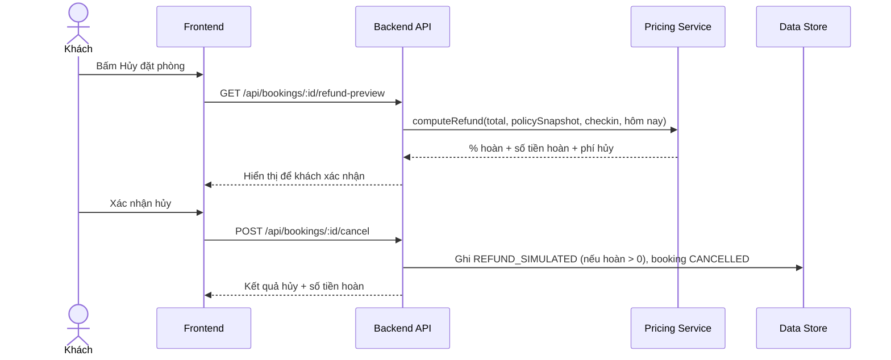

# Activity & Sequence — Hotelora

## Activity: đặt phòng & hủy/hoàn tiền

```mermaid
flowchart TD
  A[Khách chọn KS + loại phòng + ngày] --> B{Còn phòng trống<br/>theo khoảng ngày?}
  B -- Không --> B1[Báo hết phòng - 409]
  B -- Có --> C[Tính giá từng đêm<br/>ngày thường x1.0 / cuối tuần x1.15 / cao điểm x1.3]
  C --> D{Mã giảm giá?}
  D -- Có --> E{Validate ở server:<br/>hạn dùng, tối thiểu, lượt dùng}
  E -- Không hợp lệ --> E1[Từ chối - 400]
  E -- Hợp lệ --> F[Tạo booking PENDING_PAYMENT<br/>snapshot giá + chính sách, giữ phòng 15 phút]
  D -- Không --> F
  F --> G{Thanh toán mô phỏng<br/>trong 15 phút?}
  G -- Hết hạn --> G1[Booking EXPIRED, nhả phòng]
  G -- Thành công --> H[CONFIRMED + giao dịch<br/>hoa hồng sàn 10%]
  H --> I{Khách hủy?}
  I -- Có --> J[Tính hoàn theo snapshot chính sách:<br/>100% / % hủy trễ / 0% không hoàn hủy]
  J --> K[Ghi giao dịch hoàn mô phỏng<br/>Booking CANCELLED]
  I -- Không --> L[Partner check-in → check-out]
  L --> M[Khách được quyền đánh giá]
```

## Sequence: đặt phòng

```mermaid
sequenceDiagram
  actor KH as Khách
  participant FE as Frontend
  participant API as Backend API
  participant PR as Pricing Service
  participant DB as Data Store
  KH->>FE: Chọn phòng, ngày, mã giảm giá
  FE->>API: POST /api/bookings (JWT)
  API->>DB: Đọc khách sạn, loại phòng, bookings hiệu lực
  API->>PR: roomsBooked theo khoảng [checkin, checkout)
  PR-->>API: Số phòng còn trống
  alt Hết phòng
    API-->>FE: 409 Không đủ phòng trống
  else Còn phòng
    API->>PR: quoteStay(giá gốc, ngày) + validatePromo
    PR-->>API: Snapshot giá từng đêm + giảm giá
    API->>DB: Lưu booking PENDING_PAYMENT (hold 15 phút)
    API-->>FE: 201 + mã HL-XXXXXX
    KH->>FE: Bấm thanh toán mô phỏng
    FE->>API: POST /api/bookings/:id/pay
    API->>DB: Ghi Transaction (commission 10%), booking CONFIRMED
    API-->>FE: Xác nhận + mã đặt phòng
  end
```

## Sequence: hủy & hoàn tiền

```mermaid
sequenceDiagram
  actor KH as Khách
  participant FE as Frontend
  participant API as Backend API
  participant PR as Pricing Service
  participant DB as Data Store
  KH->>FE: Bấm Hủy đặt phòng
  FE->>API: GET /api/bookings/:id/refund-preview
  API->>PR: computeRefund(total, policySnapshot, checkin, hôm nay)
  PR-->>API: % hoàn + số tiền hoàn + phí hủy
  API-->>FE: Hiển thị để khách xác nhận
  KH->>FE: Xác nhận hủy
  FE->>API: POST /api/bookings/:id/cancel
  API->>DB: Ghi REFUND_SIMULATED (nếu hoàn > 0), booking CANCELLED
  API-->>FE: Kết quả hủy + số tiền hoàn
```
